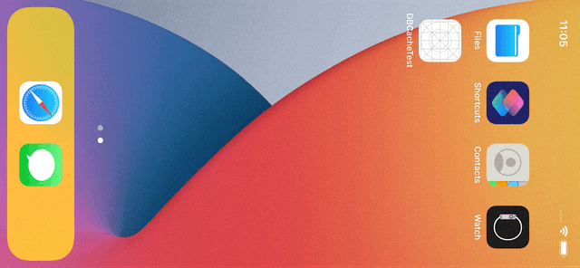

# DataBase-Cache App (iOS)

## Description

This app is made as part of my iOS development training.  

It simulates some Database. Making changes in Database is only allowed via Cache. 
You can copy entries from Database one-by-one. 

Allowed changes in Cache are:
* Add new child entry to existing parent
* Change value of entry
* Remove entry

